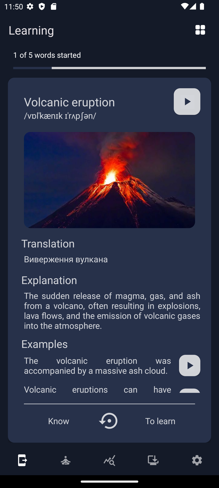
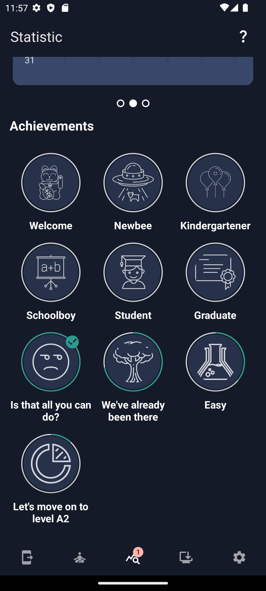

# MindVocab

MindVocab is an application for learning, memorizing, and tracking statistics of English words.

## Technology Stack

MindVocab is developed using modern technologies and approaches:

- **Programming Language**: [Kotlin](https://kotlinlang.org/)
- **Architecture Pattern**: MVVM (Model-View-ViewModel)
- **Dependency Injection**: [Hilt](https://developer.android.com/training/dependency-injection/hilt-android)
- **Asynchronous Programming**: [Kotlin Flow](https://kotlinlang.org/docs/flow.html), [Coroutines](https://kotlinlang.org/docs/coroutines-overview.html)
- **Database**: [SQLite](https://www.sqlite.org/index.html) (with [Room](https://developer.android.com/training/data-storage/room))
- ~~**Networking**: [Retrofit](https://square.github.io/retrofit/)~~
- **Navigation**: Navigation component
- **View Layer**: XML (for layout design) with [Material Design Components](https://material.io/develop/android/docs/getting-started)
- **Localization**: Android resource system for localization

## Screenshots

### Authentication

  
  
  

### Learning

  
  

  
  
  

### Word sets

  
  
  

### Repeating

  
  

  
  

### Statistic

  
  

  
  
  

### Achievements

  
  

### Settings

  
  
  

### Light theme

  
  
  

## Features

#### Word Categories
- Users can browse word categories for learning and choose which ones to study.

#### Multilingual Learning
- Ability to study words with translations for multiple languages.

#### Learning with Visuals
- Study words with images, explanations in English, and examples.

#### Flashcard Learning
- Utilize flashcards for studying words and track progress for each word.

#### Word Review
- Option to review words that were incorrectly selected for further learning.

#### Statistics and Achievements
- View statistics for all words and categories, including other relevant metrics.
- Achievements system to motivate users throughout their learning journey.

#### Motivation with Notifications
- Receive motivational notifications to encourage consistent learning.

#### Customizable Learning Experience
- Customize learning preferences, including the number of words to study per day, word selection system, and various word memorization techniques.

#### Offline Access and Progress Saving
- Access words offline and save learning progress locally on the device.

## Database Schema

